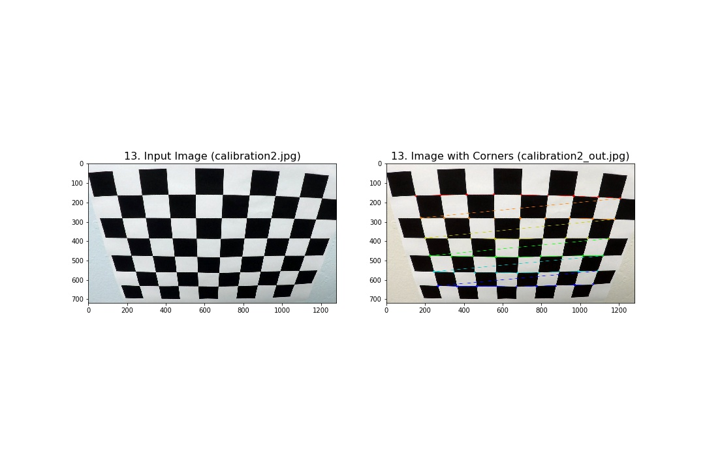
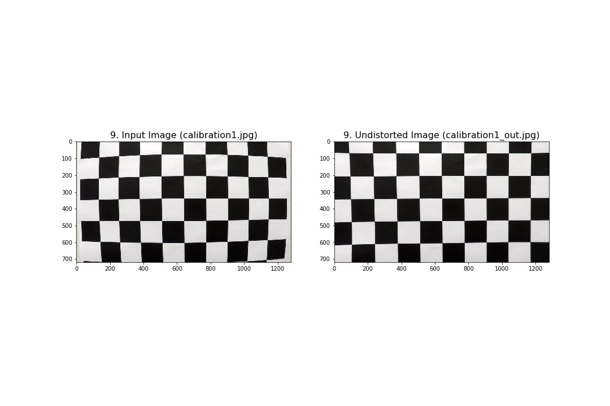
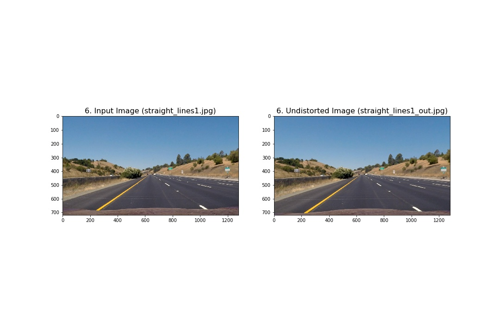
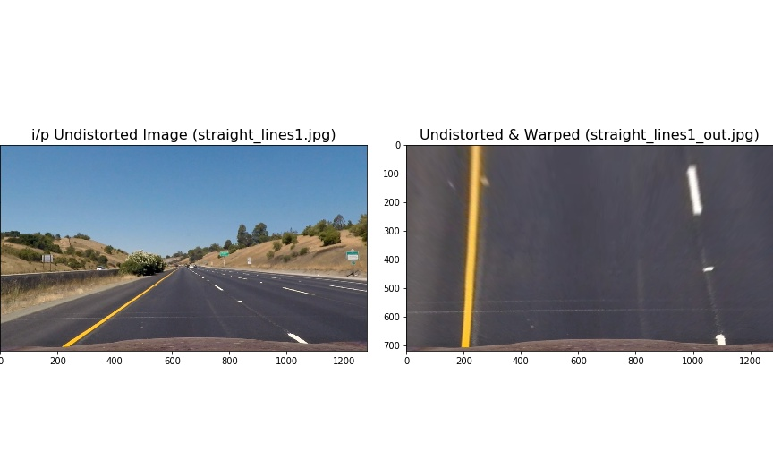
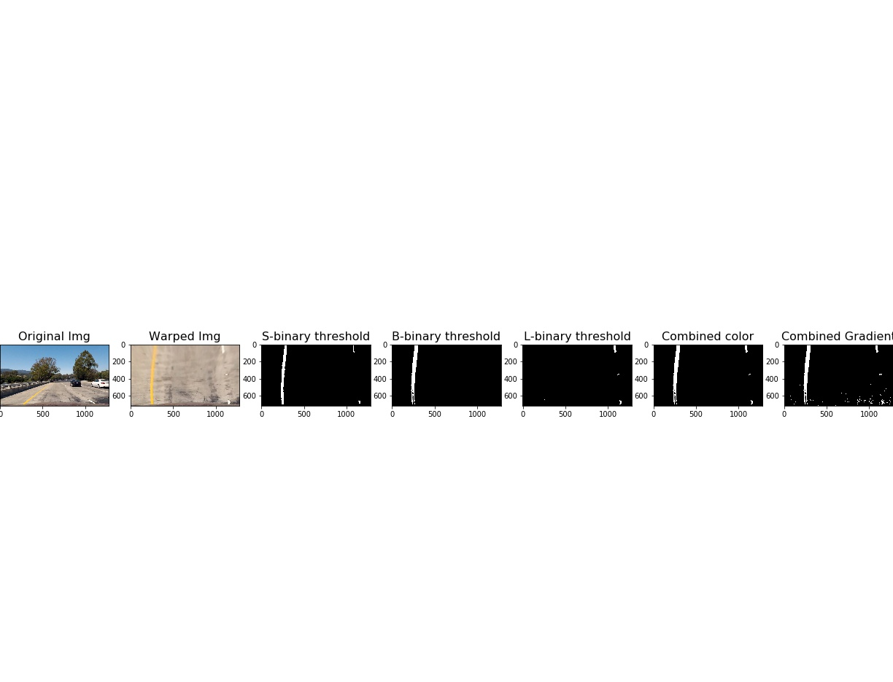
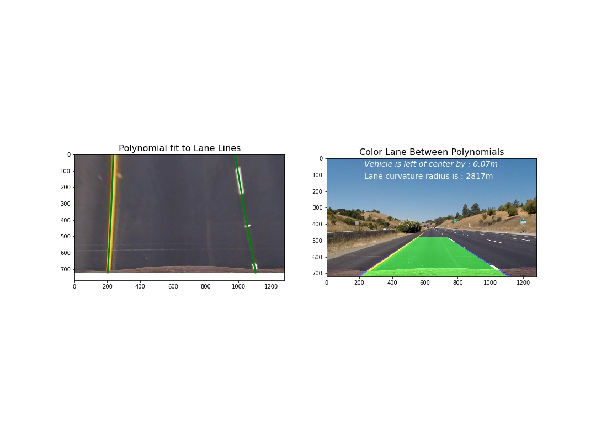

# Advanced Lane Finding


## Udacity Self Driving car Engineer Nanodegree - Project 2


The goal of this project is to develop a pipeline to process a video stream from a forward-facing camera mounted on the front of a car, and output an annotated video which identifies:
- The positions of the lane lines 
- The location of the vehicle relative to the center of the lane
- The radius of curvature of the road

The pipeline created for this project processes images in the following steps:
- **Step 1**: Apply distortion correction using a calculated camera calibration matrix and distortion coefficients.
- **Step 2**: Apply a perspective transformation to warp the image to a birds eye view perspective of the lane lines.
- **Step 3**: Apply color thresholds to create a binary image which isolates the pixels representing lane lines.
- **Step 4**: Identify the lane line pixels and fit polynomials to the lane boundaries.
- **Step 5**: Determine curvature of the lane and vehicle position with respect to center.
- **Step 6**: Warp the detected lane boundaries back onto the original image.
- **Step 7**: Output visual display of the lane boundaries and numerical estimation of lane curvature and vehicle position.

 Source Code : [Advanced_Lane_Finding](./Advanced_Lane_Finding.ipynb)

### Step 1: Distortion Correction

In this step, I have used openCV functions `findChessboardCorners` and `drawChessboardCorners` to identify the locations of corners on a series of pictures of a chessboard taken from different angles.



All Images are stored in folder [1.camera_calibration_Output](./output_images/1.camera_calibration_Output) for reference

Next, the locations of the chessboard corners were used as input to the OpenCV function `calibrateCamera` to compute the camera calibration matrix and distortion coefficients. 

Finally, the camera calibration matrix and distortion coefficients were used with the OpenCV function `undistort` to remove distortion from highway driving images.




All Images are stored in folder [2.Road_images_Output](output_images/2.Road_images_Output) for reference.

Notice that if you compare the two images, especially around the edges, there are obvious differences between the original and undistorted image, indicating that distortion has been removed from the original image.

### Step 2: Perspective Transform

The goal of this step is to transform the undistorted image to a "birds eye view" of the road which focuses only on the lane lines and displays them in such a way that they appear to be relatively parallel to eachother (as opposed to the converging lines you would normally see). To achieve the perspective transformation I first applied the OpenCV functions `getPerspectiveTransform` and `warpPerspective` which take a matrix of four source points on the undistorted image and remaps them to four destination points on the warped image. The source and destination points were selected manually by visualizing the locations of the lane lines on a series of test images.




### Step 3: Apply Binary Thresholds

In this step I attempted to convert the warped image to different color spaces and create binary thresholded images which highlight only the lane lines and ignore everything else.

Explore different color spaces ,combined and combined Gradient threshold
* Original Img : raw image
* Warped Img : After applying persective transform function
* S-binary threshold : Image after applying S-channel threshold from HLS color space(Thres_min = 170 & Thres_max = 255)
* B-binary threshold : Image after applying B-channel theshold from LAB Color space(Thres_min = 225 & Thres_max = 255)
* L-binary threshold : Image after applying L-channel threshold from LUV color space (Thres_min = 155 & Thres_max = 200)
* Combined color : Image with combined S,L,B channesl 
* Combined Gradient : Image with combined color and combined gradient threshold


Observations:
   - 'S' Channel from HLS color space:
       - Good: Identifies the white and yellow lane lines, 
       - Bad: Did not pick up 100% of the pixels in either one with the tendency to get distracted by shadows on the road.
   - 'L' Channel from LUV color space:
       - Good: Picks up almost all the white lane lines, but 
       - Bad: completely ignores the yellow lines.
   - 'B' channel from the LAB color space:
       - Good : Identifies the yellow lines much better than S channel, but 
       - BAd: Completely ignores the white lines.
   -  Combined Gradient threshold Sobelx,Sobely,mag_thershold,dir_threshold and combine S,L,B Channel
       - Good: It identifies both whilte and yellow lane
       - Bad: Some unwanted pixel like noise 
       
Ceated a combined binary threshold based on the above three mentioned binary thresholds. 
Combined binary threshold is more clear comparitive with combined gradient threshold 

All Images are stored in folder [5.color_gradient_bin_threshold_Output](output_images/5.color_gradient_bin_threshold_Output) for reference


### Steps 4, 5 and 6: Fitting a polynomial to the lane lines, calculating vehicle position and radius of curvature:
At this point I was able to use the combined binary image to isolate only the pixels belonging to lane lines. The next step was to fit a polynomial to each lane line, which was done by:
- Identifying peaks in a histogram of the image to determine location of lane lines.
- Identifying all non zero pixels around histogram peaks using the numpy function `numpy.nonzero()`.
- Fitting a polynomial to each lane using the numpy function `numpy.polyfit()`.

After fitting the polynomials I was able to calculate the position of the vehicle with respect to center with the following calculations:
- Calculated the average of the x intercepts from each of the two polynomials `position = (rightx_int+leftx_int)/2`
- Calculated the distance from center by taking the absolute value of the vehicle position minus the halfway point along the horizontal axis `distance_from_center = abs(image_width/2 - position)`
- If the horizontal position of the car was greater than `image_width/2` than the car was considered to be left of center, otherwise right of center.
- Finally, the distance from center was converted from pixels to meters by multiplying the number of pixels by `3.7/900`.

**As per Reviewers comment , I have corrected Radius of curvature function**

 ` The radius of curvature and the position inside the lane seem to be consistent with the actual frames. Well done.

However the radius values are too high. This is because in method calculate_radius_of_curvature the polynomial is used with a value in wrong units: fit_cr is a polynomial in the real world, meaning that both its input and output are measured in meters. However in the radius-calculation it is used with np.max(y_vals) which is a pixel-value. That value should be converted to meters, too, before using with fit_cr (with the help of ym_per_pix).

Another issue is that the values of variable xm_per_pix and ym_per_pixare not consistent with the perspective transformation. In xm_per_pix = 3.7/700, the value 3.7 is the width of the lane in meter, the value 700 is the same in pixels on the birds-eye view image at the bottom of the image. Based on the perspective transformation example I would say that the width of the lane is more, around 900 pixels. Also ym_per_pix = 30/720 should be adjusted. Here 30 is the length of the detected portion of the lane in meters. In your case I would say it is less than 30m, it is around 15m.`


Next I used the following code to calculate the radius of curvature for each lane line in meters:

* Value is corrected in by adding **`np.max(lef_y)*ym_per_pix`**
* `xm_per_pix = 3.7/900 # meteres/pixel in x dimension` As my pixel on birds eye view image at bottem is around 900
* `ym_per_pix = 15.0/720 # meters/pixel in y dimension` My case for ym_per_pix its 15 meter
```
# Find radius of curvature for both lane line
    xm_per_pix = 3.7/900 # meteres/pixel in x dimension
    ym_per_pix = 15.0/720 # meters/pixel in y dimension
   
    left_lane_fit_curvature = np.polyfit(left_y*ym_per_pix, left_x*xm_per_pix, 2)
    right_lane_fit_curvature = np.polyfit(right_y*ym_per_pix, right_x*xm_per_pix, 2)
    radius_left_curve = ((1 + (2*left_lane_fit_curvature[0]* (np.max(left_y)*ym_per_pix) + left_lane_fit_curvature[1])**2)**1.5) \
                                 /np.absolute(2*left_lane_fit_curvature[0])
    radius_right_curve = ((1 + (2*right_lane_fit_curvature[0]*(np.max(left_y)*ym_per_pix)+ right_lane_fit_curvature[1])**2)**1.5) \
                                    /np.absolute(2*right_lane_fit_curvature[0])                              
 
```
* Value is corrected by adding **`np.max(y_vals)*ym_per_pix`**

```
 
    def calculate_radius_of_curvature(self, x_vals, y_vals):
        ym_per_pix = 15./720 # meters per pixel in y dimension  ## Change made as per reviewer feedback
        xm_per_pix = 3.7/900 # meteres per pixel in x dimension ## Change made as per reviewer feedback
        
        fit_cr = np.polyfit(y_vals*ym_per_pix, x_vals*xm_per_pix, 2)
        curverad = ((1 + (2*fit_cr[0]*(np.max(y_vals)*ym_per_pix) + fit_cr[1])**2)**1.5) \ #Changes made as per reviewer Feedback
                                     /np.absolute(2*fit_cr[0])
```

After making changes - videos are in folder [processed_output_videos](./processed_output_videos) 


The final radius of curvature was taken by average the left and right curve radius.

All code is clearly explained with anotation in Notebook


### Step 7: Output visual display of the lane boundaries and numerical estimation of lane curvature and vehicle position.
The final step in processing the images was to plot the polynomials on to the warped image, fill the space between the polynomials to highlight the lane that the car is in, use another perspective trasformation to unwarp the image from birds eye back to its original perspective, and print the distance from center and radius of curvature on to the final annotated image.



All Images are stored in folder [6.lane_color_Output](output_images/6.lane_color_Output) for reference


## Video Processing Pipeline:

The pipleline steps are:
* Takes an image of road as the input.(Video frame by frame)
* Undistort the image with camera calibration.
* Transforms the region of interest into different view,
    gets a top-view of the road.
* Applies color thresholding to get a binary representation
    of lane lines.
* Detects the lane line pixels and fits a second order polynomial 
    to those pixel coordinates.
* Measures the curvature radius of the lane and the position of
    the vechicle in the lane.
* Colors the lane, transforms back to it's previous viewpoint
    resulting the desired final image.
    
 |Project Video|Challenge Video|
|-------------|-------------|
|||   


All process videos are in folder [processed_output_videos](./processed_output_videos)


### Possible Limitations:

Video pipeline worked great for Project test video and good with challenge video but with in some cases it loose lane due to heavy shadow over road.

Limitation of this pipeline : It is not ready to detect lane under extreme light or shadow or faded lane lines condition. Big challenge I faced to find single combination of color space or threshold that work for all. I will try to refine my pipeline as I learn new techniques to tackle such problem. I m really intersted to know how in real world scenario self driving cars which are already on road able to manage such situations. To process those videos it is taking time how it works with realtime stream of video.

I took feedback from Reviewer , As I m learning I will be fine tuning my pipeline based on feedback and come up with more robust pipeline.

All my work is clearly explained in [Notebook](./Advanced_Lane_Finding.ipynb) for further reference.


